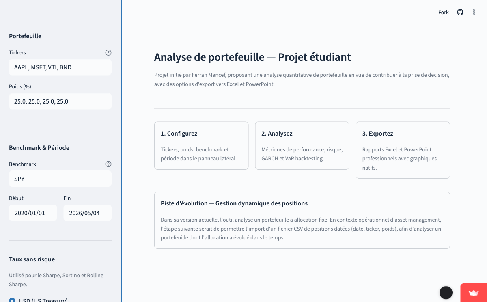
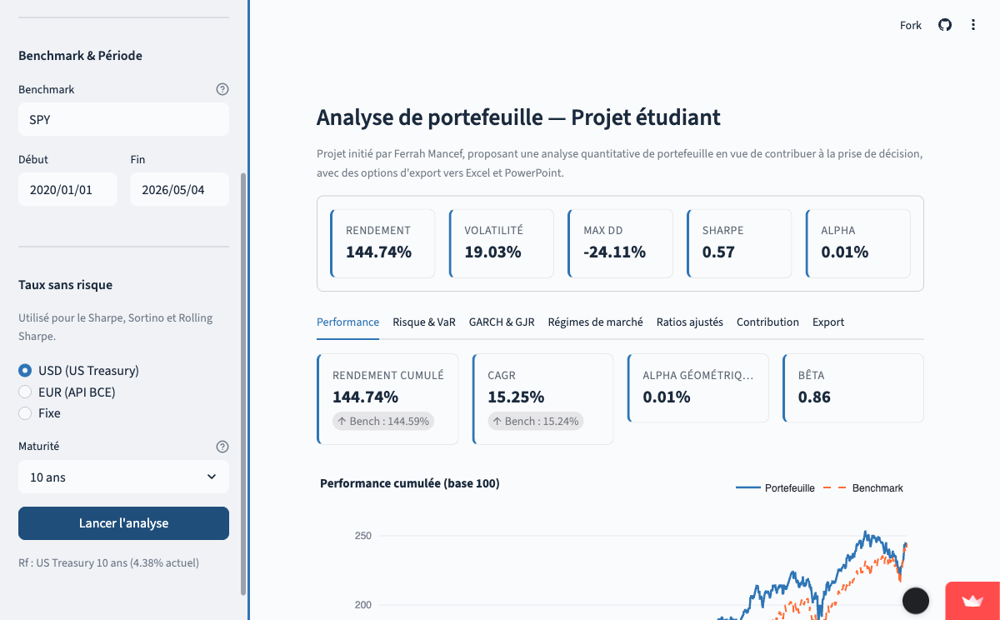
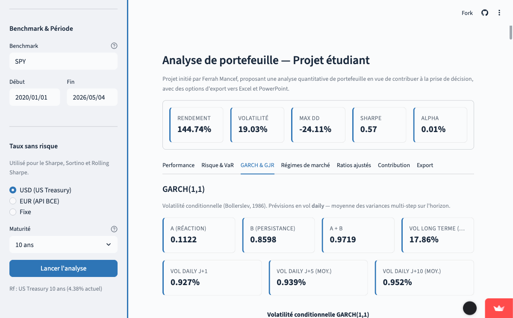

# Portfolio Analyzer

Outil Streamlit d'analyse quantitative pour un portefeuille multi-actifs.

🔗 **[Démo en ligne](https://analyse-portefeuille-ferrah-mancef.streamlit.app)** · hébergé sur Streamlit Community Cloud



## L'idée

Quand on regarde un portefeuille a posteriori, trois questions reviennent toujours :

1. **Est-ce que j'ai créé de la valeur ?** — performance absolue et vs benchmark
2. **À quel prix ?** — risque, drawdown, VaR, volatilité conditionnelle
3. **Est-ce que le jeu en valait la chandelle ?** — ratios ajustés du risque

J'ai construit l'outil autour de ces trois questions, en y ajoutant une détection de régime de marché (Markov Switching) et des exports Excel + PowerPoint pour livrer un rendu propre.





---

## Fonctionnalités

### Métriques de performance
- Rendement cumulé, CAGR (rendement annualisé)
- Alpha géométrique vs benchmark
- Bêta (sensibilité au marché)

### Mesure du risque
- Volatilité annualisée
- Maximum Drawdown et durée
- Tracking Error
- **VaR historique 95% et 99%** (horizon 1 jour)
- **CVaR / Expected Shortfall**
- **Backtesting de Kupiec** — test out-of-sample sur fenêtre rolling 504 jours (standard Bâle III)

### Modèles de volatilité conditionnelle
- **GARCH(1,1)** (Bollerslev, 1986) — volatility clustering, prévisions daily multi-step
- **GJR-GARCH(1,1)** (Glosten-Jagannathan-Runkle, 1993) — effet de levier (asymétrie), coefficient γ
- Prévisions J+1, J+5, J+10 en daily (pas d'annualisation sqrt(T), incohérente avec GARCH)

### Détection de régime
- **Markov Switching** à 2 régimes (Hamilton, 1989)
- Régime calme (faible vol) vs stress (forte vol) — identification automatique
- Probabilité filtrée et lissée du régime stress
- Matrice de transition et durée espérée de chaque régime

### Ratios ajustés du risque
- **Sharpe** — rendement excédentaire par unité de risque total
- **Sortino** (Sortino & Price, 1994) — downside deviation correcte (N total au dénominateur)
- **Information Ratio** — alpha par unité de risque actif
- **Calmar** — CAGR / |Max Drawdown|
- **Rolling Sharpe** (1 an glissant) avec Rf time-varying

### Taux sans risque dynamique
- **USD** : US Treasury (3 mois, 5 ans, 10 ans) via Yahoo Finance — série daily
- **EUR** : courbe des taux zéro-coupon AAA via l'API BCE (modèle Svensson) — données exactes
- **Fixe** : valeur manuelle
- Le Sharpe/Sortino utilisent le dernier taux disponible (Rf actuel)
- Le Rolling Sharpe utilise le Rf du jour à chaque point (time-varying)

### Analyse de contribution
- Contribution à la performance par actif (poids × rendement cumulé)
- Décomposition du risque par actif (Euler decomposition)
- Matrice de corrélation avec color-coding (> 0.8 = risque de concentration)

### Exports
- **Excel (.xlsx)** — 8 onglets avec données, métriques et graphiques natifs Excel
- **PowerPoint (.pptx)** — 9 slides avec graphiques haute résolution, basé sur un masque personnalisé

---

## Architecture

```
portfolio-analyzer/
├── app.py                      # Point d'entrée Streamlit
├── requirements.txt
├── template.pptx               # Masque PowerPoint
├── .streamlit/config.toml      # Configuration du thème
│
├── core/                       # Logique métier (indépendant de Streamlit)
│   ├── data_loader.py          # Adapter : Yahoo Finance, API BCE
│   ├── portfolio.py            # Classe Portfolio : rendements pondérés
│   ├── metrics.py              # Métriques pures (fonctions testables)
│   ├── contribution.py         # Attribution performance/risque
│   ├── export.py               # Export Excel avec graphiques natifs
│   └── export_pptx.py          # Export PowerPoint
│
├── ui/                         # Interface Streamlit
│   ├── sidebar.py              # Configuration du portefeuille
│   ├── dashboard.py            # Layout principal (onglets)
│   └── charts.py               # Graphiques Plotly
│
└── tests/                      # 38 tests unitaires
    ├── test_metrics.py
    └── test_portfolio.py
```

**Principes d'architecture :**
- **Séparation UI / logique métier** : le dossier `core/` ne dépend pas de Streamlit. Les calculs sont testables sans lancer l'app.
- **Pattern adapter** sur les données : `data_loader.py` abstrait la source. Si Yahoo Finance change demain, on modifie un seul fichier.
- **Fonctions pures** dans `metrics.py` : chaque métrique prend des arrays et retourne un scalaire. Testable, lisible, maintenable.

---

## Installation locale

```bash
git clone https://github.com/Manceff/portfolio-analyzer.git
cd portfolio-analyzer
python -m venv .venv
source .venv/bin/activate
pip install -r requirements.txt
streamlit run app.py
```

L'application sera accessible sur `http://localhost:8501`.

---

## Tests

```bash
python -m pytest tests/ -v
```

38 tests couvrant : rendements, volatilité, drawdown, VaR/CVaR, Kupiec (out-of-sample), GARCH, GJR-GARCH, Markov Switching, bêta, tracking error, Portfolio class.

---

## Stack technique

| Composant | Librairie | Justification |
|---|---|---|
| Interface | Streamlit | Prototypage rapide, rendu propre |
| Données | yFinance, API BCE | Gratuit, temps réel |
| Calcul | NumPy, Pandas, SciPy | Standard industrie |
| GARCH | arch | Référence pour les modèles de volatilité |
| Régimes | statsmodels | Markov Switching (Hamilton) |
| Visualisation | Plotly | Graphiques interactifs |
| Export Excel | OpenPyXL | Graphiques natifs Excel |
| Export PowerPoint | python-pptx | Slides avec images HD |
| Tests | Pytest | 38 tests unitaires |

---

## Méthodologie

La section **Méthodologie** en bas du dashboard détaille chaque choix :

1. **Données** — Yahoo Finance, rendements arithmétiques, rééquilibrage quotidien
2. **Taux sans risque** — US Treasury / BCE AAA yield curve / fixe
3. **Performance** — CAGR, alpha géométrique, bêta
4. **Risque** — volatilité, drawdown, tracking error
5. **VaR** — historique 1 jour, backtesting Kupiec rolling 504j (Bâle III)
6. **Ratios** — Sharpe, Sortino (formule correcte), IR, Calmar
7. **GARCH / GJR-GARCH** — vol daily, prévisions multi-step
8. **Markov Switching** — 2 régimes, probabilités filtrées/lissées
9. **Contribution** — attribution buy-and-hold, Euler decomposition

---

## Pistes d'évolution

### Gestion dynamique des positions
Aujourd'hui les poids du portefeuille sont fixes sur toute la période. En pratique un gérant ajuste ses positions en continu. La suite logique : permettre l'import d'un fichier CSV de positions datées (date, ticker, poids ou quantité) pour analyser un portefeuille dont l'allocation a réellement varié dans le temps. Ça permet aussi des métriques d'attribution dynamiques (Brinson-Fachler).

### Autres pistes
- **Frontière efficiente** (Markowitz) — optimisation mean-variance avec contraintes
- **Stress testing** — simulation de scénarios historiques (COVID, 2008, hausse des taux 2022) sur le portefeuille actuel
- **Multi-devises** — gestion du risque de change pour les portefeuilles internationaux
- **API REST** — exposer les calculs comme un service
- **Authentification** — multi-utilisateurs avec sauvegarde des portefeuilles (Supabase)
